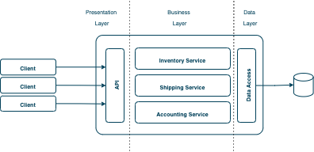
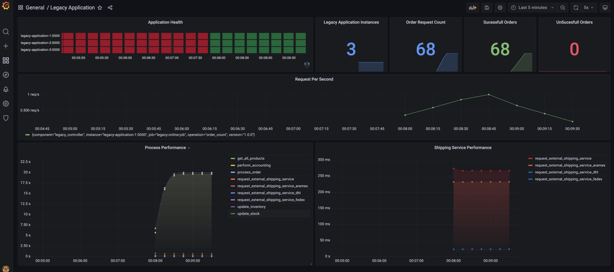
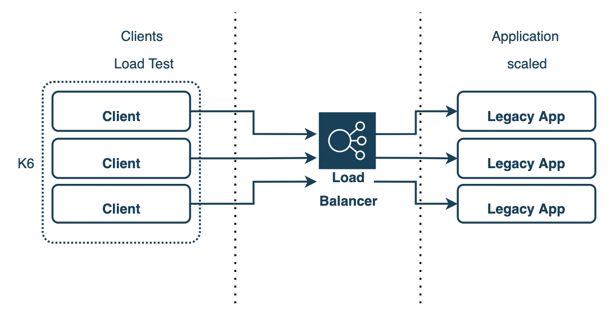
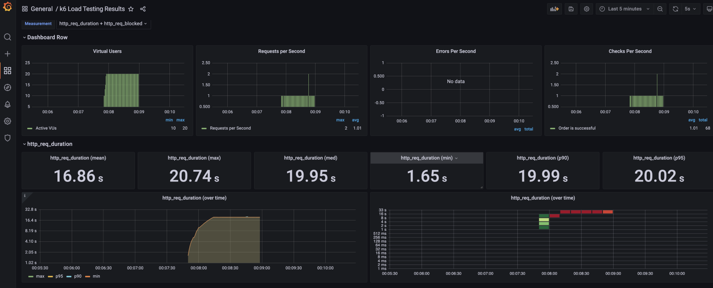

# online-store
[](https://github.com/fazleyKholil/online-store/actions/workflows/docker-compose-build.yml)

Demo online store demonstrating a monolith application

# Application Structure


## Running locally

When running in docker, all components use port 5000 internal to the container, and are exposed at ports from 5000 upwards:
For demo purposes, 3 instances of the application will be running and is accessible on individual endpoints.
To load balance between the apps, use the 8080 port.

|Component   | Exposed Port  |  Url |Description |
|---|---|---|---|
| legacy-application-1 | 5001 | http://localhost:5001/_system/health |Service Instance|
| legacy-application-2 | 5002 | http://localhost:5001/_system/health |Service Instance|
| legacy-application-3 | 5003 | http://localhost:5001/_system/health |Service Instance|
| Through Load Balancer | 8080 | http://localhost:8080/_system/health |Through Load balancer|
| Prometheus | 9090 | http://localhost:9090 |Scrapping application metrics|
| Grafana | 9090 | http://localhost:3001 |Metrics Dashbaords / Observability|

### Running locally commands
To bring up the infrastructure needed and the services, the `docker-compose` file can be executed:

```
docker-compose up --build --force-recreate
```

The below services should be created
```bash
Creating grafana                        ... done
Creating online-store-legacy_influxdb_1 ... done
Creating legacy-application-1           ... done
Creating prometheus                     ... done
Creating online-store-legacy_nginx_1    ... done
```

Use this command to check if all the services is up and running
```bash
Fazley.Kholil@MAC online-store-legacy % docker ps
CONTAINER ID   IMAGE                                      COMMAND                  CREATED         STATUS         PORTS                                       NAMES
ff069416de76   influxdb:1.8                               "/entrypoint.sh infl…"   2 minutes ago   Up 2 minutes   0.0.0.0:8086->8086/tcp, :::8086->8086/tcp   online-store-legacy_influxdb_1
fb345a28ef0f   online-store-legacy_legacy-application-1   "dotnet OnlineStore.…"   2 minutes ago   Up 2 minutes   0.0.0.0:5001->5000/tcp, :::5001->5000/tcp   legacy-application-1
7835b912adaf   online-store-legacy_grafana                "/run.sh"                2 minutes ago   Up 2 minutes   0.0.0.0:3001->3000/tcp, :::3001->3000/tcp   grafana
abf5ab84db34   online-store-legacy_prometheus             "/bin/prometheus --c…"   2 minutes ago   Up 2 minutes   0.0.0.0:9090->9090/tcp, :::9090->9090/tcp   prometheus
```

### Sample Request

```
curl --location --request POST 'http://localhost:8080/Legacy/order' \
--header 'Content-Type: application/json' \
--data-raw '{
  "products": [
    {
      "productId": "0acc81de-de63-45b5-864a-dd6637a75ca4",
      "quantity": 2
    }
  ],
  "isShippingExpress": true,
  "shippingDistance": 100
}'
```


### Monitoring

We use [Prometheus](https://prometheus.io/) and [Grafana](https://grafana.com/) for instrumentation, monitoring and analytics.

The application exposes an endpoint at `/_system/metrics-text` containing aggregated metrics built with the help of [Prometheus](https://prometheus.io/).

You can find a docker compose file (`docker-compose.yml`) that will start both prometheus and grafana along with provisioned dashboards.


Prometheus will be accessible at http://localhost:9090/

Grafana will be accessible at http://localhost:3001/ (username: admin, password: admin).
To be able to view the dashboard, create a prometheus datasource named *prometheus* and the provisioned dashboard will result as below.



### Running Load Test Locally
```
docker-compose -f docker-compose.loadtests.yml up --build
```




Expected results on terminal : 
```
Fazley.Kholil@MAC online-store-legacy % docker-compose -f docker-compose.loadtests.yml up --build
WARNING: Found orphan containers (legacy-application-1, online-store-legacy_nginx_1, legacy-application-2, grafana, prometheus, legacy-application-3, online-store-legacy_influxdb_1) for this project. If you removed or renamed this service in your compose file, you can run this command with the --remove-orphans flag to clean it up.
Building k6
[+] Building 0.2s (8/8) FINISHED                                                                                                                                                                                                                            
 => [internal] load build definition from Dockerfile                                                                                                                                                                                                   0.0s
 => => transferring dockerfile: 37B                                                                                                                                                                                                                    0.0s
 => [internal] load .dockerignore                                                                                                                                                                                                                      0.0s
 => => transferring context: 2B                                                                                                                                                                                                                        0.0s
 => [internal] load metadata for docker.io/loadimpact/k6:latest                                                                                                                                                                                        0.0s
 => [1/3] FROM docker.io/loadimpact/k6                                                                                                                                                                                                                 0.0s
 => [internal] load build context                                                                                                                                                                                                                      0.0s
 => => transferring context: 1.98kB                                                                                                                                                                                                                    0.0s
 => CACHED [2/3] COPY ./scripts/ /                                                                                                                                                                                                                     0.0s
 => [3/3] COPY ./test-cycles/ /                                                                                                                                                                                                                        0.0s
 => exporting to image                                                                                                                                                                                                                                 0.0s
 => => exporting layers                                                                                                                                                                                                                                0.0s
 => => writing image sha256:affd0af97a6caf43b203a755df9670d64ab428007d58c45888c27020b2510fb3                                                                                                                                                           0.0s
 => => naming to docker.io/library/k6                                                                                                                                                                                                                  0.0s

Use 'docker scan' to run Snyk tests against images to find vulnerabilities and learn how to fix them
Recreating k6 ... done
Attaching to k6
k6    | 
k6    |           /\      |‾‾| /‾‾/   /‾‾/   
k6    |      /\  /  \     |  |/  /   /  /    
k6    |     /  \/    \    |     (   /   ‾‾\  
k6    |    /          \   |  |\  \ |  (‾)  | 
k6    |   / __________ \  |__| \__\ \_____/ .io
k6    | 
k6    |   execution: local
k6    |      script: /2.load-test-script.js
k6    |      output: influxdb (http://influxdb:8086)
k6    | 
k6    |   scenarios: (100.00%) 1 scenario, 20 max VUs, 1m20s max duration (incl. graceful stop):
k6    |            * loadTest: Up to 20.00 iterations/s for 50s over 4 stages (maxVUs: 10-20, gracefulStop: 30s)
k6    | 
k6    | 
k6    | running (0m01.0s), 10/10 VUs, 0 complete and 0 interrupted iterations
k6    | loadTest   [   2% ] 05/10 VUs  01.0s/50s  06 iters/s
k6    | 
k6    | running (0m02.0s), 10/10 VUs, 1 complete and 0 interrupted iterations
k6    | loadTest   [   4% ] 09/10 VUs  02.0s/50s  06 iters/s
..........
k6    | 
k6    | running (1m09.3s), 00/20 VUs, 68 complete and 0 interrupted iterations
k6    | loadTest ✓ [ 100% ] 20/20 VUs  50s  10 iters/s
k6    | 
k6    |      █ Create a new order
k6    | 
k6    |        ✓ Order is successful
k6    | 
k6    |      checks.........................: 100.00% ✓ 68   ✗ 0   
k6    |      data_received..................: 22 kB   319 B/s
k6    |      data_sent......................: 19 kB   279 B/s
k6    |      dropped_iterations.............: 706     10.181376/s
k6    |      group_duration.................: avg=16.87s   min=1.64s  med=19.97s   max=20.77s p(90)=20.01s   p(95)=20.02s  
k6    |      http_req_blocked...............: avg=297.01µs min=23.6µs med=40.5µs   max=2.59ms p(90)=856.02µs p(95)=898.83µs
k6    |      http_req_connecting............: avg=154.73µs min=0s     med=0s       max=1.17ms p(90)=555.87µs p(95)=600.17µs
k6    |    ✗ http_req_duration..............: avg=16.85s   min=1.64s  med=19.94s   max=20.73s p(90)=19.99s   p(95)=20.01s  
k6    |        { expected_response:true }...: avg=16.85s   min=1.64s  med=19.94s   max=20.73s p(90)=19.99s   p(95)=20.01s  
k6    |    ✓ http_req_failed................: 0.00%   ✓ 0    ✗ 68  
k6    |      http_req_receiving.............: avg=207.42µs min=91µs   med=179.4µs  max=2.09ms p(90)=251.01µs p(95)=262.84µs
k6    |      http_req_sending...............: avg=149.97µs min=43.5µs med=111.95µs max=1.06ms p(90)=234.17µs p(95)=285.24µs
k6    |      http_req_tls_handshaking.......: avg=0s       min=0s     med=0s       max=0s     p(90)=0s       p(95)=0s      
k6    |      http_req_waiting...............: avg=16.85s   min=1.64s  med=19.94s   max=20.73s p(90)=19.99s   p(95)=20.01s  
k6    |      http_reqs......................: 68      0.980642/s
k6    |      iteration_duration.............: avg=16.87s   min=1.64s  med=19.97s   max=20.77s p(90)=20.01s   p(95)=20.02s  
k6    |      iterations.....................: 68      0.980642/s
k6    |      tpsCounter.....................: 68      0.980642/s
k6    |      vus............................: 20      min=10 max=20
k6    |      vus_max........................: 20      min=10 max=20
k6    | 
k6    | time="2022-10-16T20:08:59Z" level=error msg="some thresholds have failed"
k6 exited with code 99
Fazley.Kholil@MAC-C02C96SNMD6M online-store-legacy % docker-compose -f docker-compose.loadtests.yml up --build
```

Expected result on Grafana :
